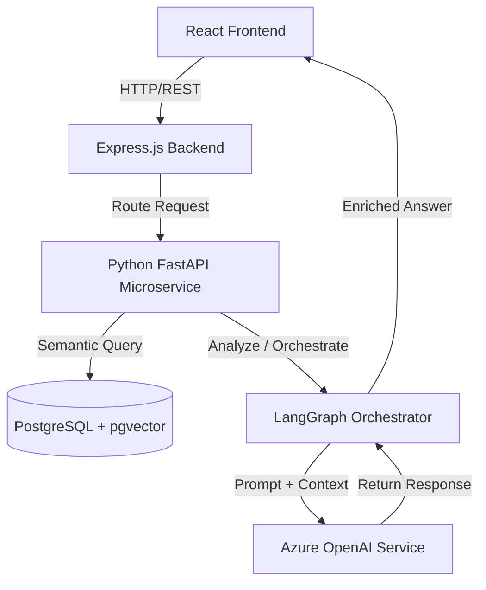

# 📁 College Internship & Personal Project Tracker

This document is the centralized blueprint and execution canvas for Anchal's college-mandated internship project (1-Credit, IGDTUW). The coaching AI must use this to track project sprints and architectural schemas.

---

## 🏛️ Project Canvas: AI-Agent/RAG System (Template)

### 📌 Project Metadata
- **Project Name**: *[To be decided - Target: June 12, 2026]*
- **Description**: An enterprise-grade Retrieval-Augmented Generation (RAG) or Multi-Agent System designed to solve a specific industry problem.
- **Academic Advisor**: *[IGDTUW Instructor Name]*
- **SDE Coach**: Anchal-Coach AI Agent
- **Target Completion Date**: Friday, July 10, 2026
- **Current Phase**: Ideation & Research (Phase 1)

---

### 🛠️ Proposed Tech Stack
- **Frontend**: React.js (TypeScript), TailwindCSS
- **Backend / Router**: Node.js, Express.js
- **Database / Vector Store**: PostgreSQL + pgvector, or MongoDB
- **AI Engine**: Python (FastAPI/Flask) + PyTorch + LangGraph/Semantic Kernel
- **LLM Provider**: Azure AI Foundry / Azure OpenAI endpoints (leveraging Azure AI practices)

---

### 📐 Target System Architecture (Concept)

---

### ⏱️ Implementation Milestones

#### 📅 Week 1-2 (June 8 - June 19) - Research & Design
- [ ] Attend college orientation sessions and collect grading rubric.
- [ ] Brainstorm and select 3 high-impact project ideas (e.g., Academic Syllabus Advisor, AI Health Copilot, or Female SDE Resume Evaluator).
- [ ] **Milestone 1**: Lock the final project topic and write a comprehensive System Architecture Spec document. Save it in the SDLC Artifact Library.

#### 📅 Week 3 (June 22 - June 26) - Scaffolding & Database Setup
- [ ] Set up the React frontend workspace with Vite and TailwindCSS.
- [ ] Build the Express.js server scaffolding and establish PostgreSQL/MongoDB connections.
- [ ] Scaffolding of pgvector database and write chunking/embedding pipeline scripts in Python.
- [ ] **Milestone 2**: Successfully run a local document indexing script that chunks a sample PDF and saves embeddings in the database.

#### 📅 Week 4 (June 29 - July 3) - Core AI Orchestration (Project Sprint Starts)
- [ ] Connect the Express backend to the Python AI microservice.
- [ ] Build the core RAG retrieval logic. Implement a hybrid search query (keyword + vector).
- [ ] Implement multi-agent workflows using LangGraph (e.g., Router Agent, Evaluator Agent, Writer Agent).
- [ ] **Milestone 3**: Run end-to-end command-line tests showing the multi-agent system responding accurately to complex queries.

#### 📅 Week 5 (July 6 - July 10) - UI Integration & Deployment
- [ ] Connect the React frontend to the backend REST endpoints. Build beautiful, modern conversation windows, file uploads, and dashboard widgets.
- [ ] Secure API keys using Azure Key Vault and Managed Identities (incorporating cloud security guidelines).
- [ ] Run full smoke tests to capture and fix any latency or hallucinations.
- [ ] **Milestone 4**: Final live demonstration, compilation of project report, and submission to the IGDTUW evaluation portal.

---

## 🎨 Personal Project: SDE Success Dashboard (GitHub Pages)

### 📌 Dashboard Metadata
- **Project Name**: Anchal SDE Success Dashboard
- **Hosting URL**: [https://avanish-gupta-cse.github.io/Anchal-Coach/](https://avanish-gupta-cse.github.io/Anchal-Coach/)
- **Repository**: [https://github.com/Avanish-Gupta-CSE/Anchal-Coach](https://github.com/Avanish-Gupta-CSE/Anchal-Coach)
- **Features**:
  - Interactive status trackers for all 5 SDE study tracks.
  - Interactive "Today's Goals" checklist (persisted locally using HTML5 LocalStorage).
  - Weekly syllabus roadmap view.
  - Direct access links to the complete Harkirat Lecture catalog.
  - Responsive, modern glassmorphic theme designed using Tailwind CSS.

